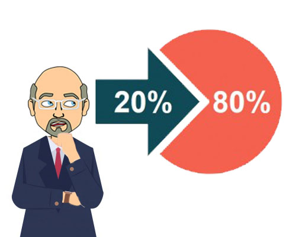

---
layout: single
name: rfm-analizi-ile-musteri-segmenti
title: "RFM Analizi ile Müşteri Segmenti"
category: articles
---

Şirketler müşterilerini tanımak, pazar paylarının sınırlarını gözlemlemek ve sınırları zorlamak ister. Bu sebeple müşteri verileri toplar, onları analiz eder, onlara bir değer atfederler. Hangi verilerin toplanacağı, hangi analizlerin yapılacağı hususunda doğru kararlar verilmesi önemlidir.

"CRM Sistemi" dediğimizde, merkezde müşterinin olduğu bir sistem hayal ederiz. Bu sistem yönetiminin sonucundaki çıktılarla müşterileri kaybetmeden yeniden satışa teşvik etmeyi hedefleriz. Bu bağlamda en optimum yöntemleri kullanmaya, kaynakları doğru harcayarak pastadaki büyük dilimi elimizde tutmaya çabalarız. Buna uygun matematiksel modelleri geliştirir, buna uygun müşteri yönetim yöntemlerini saptamaya çalışırız.

[Pareto](https://tr.wikipedia.org/wiki/Pareto_ilkesi) bizlere şunu söyler: *"Elindeki en tepe %20-%30'luk kitle, senin %70-%80'lik kazancını sağlar"*. Yani 100 müşteri sana 10.000 TL kazandırıyorsa, bunların içerisindeki en çok ciro kazandıran 20-30 müşteri, sana 7.000-8.000 TL civarında ciro kazandırmaktadır. Hayatınızdaki hemen hemen her şeyde bunu uygulayabilirsiniz. Toplam 100 kalem gideriniz varsa, en tepedeki 20 gider, sizin paranızın %80'ini harcamaktadır. Toplam 1000 ürününüz varsa, en tepedeki 200 ürün, size cironuzun %80'ini kazandırmaktadır *(80'e 20, ya da 70'e 30)*. Buna göre aslında hangi müşterilerinizin ne kadar size katkı sağladığını basit bir sıralama ile fark edebiliyorsunuz. Buraya kadar her şey tamam. Peki bu müşteriyi tutmak mı, yoksa sürekli yeni müşterilere yatırım yapmak mı daha kârlı?

> Temel anlamda İlişkisel Pazarlama'nın temelinin **yeni müşteriler bulmaktan ziyade mevcut müşterileri tutma ve onlarla ilişkileri geliştirme** üzerine olduğu bilinmektedir. 
> 
> <cite>Öztürk S. A. (2003). Hizmet Pazarlaması, Ekin Kitabevi, İstanbul: 179-180.</cite>

Prof. Dr. Sevgi Ayşe Öztürk'ün kitabında yazılana göre asıl büyük eforu yeni müşteriler elde etmektense, mevcudu kaybetmeme adına sarf etmenin daha uygun olacağı belirtilmekte.

Elimizde 1.000.000 TL pazarlama bütçesi olduğunu varsayalım. O halde bu paranın büyük çoğunluğunu mevcudu korumak için harcamam lazım. Tüm VIP müşterilerime *(en tepe %20 olduğunu varsayalım)* hediye olarak ücretsiz ürün paketi gönderdim, diğer müşterilerime de kampanyalar sağladım *(farzı misal 700.000 TL)*. Kalan bütçeyi de reklamlarla ya da havuçlarla yeni müşteri çekmeye harcadım. Buradaki senaryoyu okuyanlar problemin kaynağını hemen anlayacaktır. Büyüme, sürekli aynı müşterilere ürün satarak **sağlanamaz**. <u>Eldeki mevcudu tutarken yeni müşteri de kazanmanız gerekir</u>.

İşte bu durumu optimum bir şekilde yönetmek ve yeni müşteriler kazanmak için daha fazla kaynak ayırabilmek adına bir takım analizler ile müşterinin gitmeye meyilli olup olmadığı, riskteki büyük cirolu müşterileri, potansiyel VIP müşterileri vs... gruplamamız ve güncel olarak denetlememiz gereklidir. Bu bağlamda müşteri değerini ve sadakatini analiz etmede farklı metotlar geliştirilmiştir. Bunlardan birisi de **RFM Analizi**'dir.

RFM Analizi müşteriyi sadece parasal değerde değil, aynı zamanda sıklık ve güncellik boyutlarında da analiz eden bir yöntemdir. RFM Analizinin 3 temel boyutu vardır. Bunlar;

-   **R**ecency *(Güncellik)*
-   **F**requency *(Sıklık)*
-   **M**onetary Value *(Parasal Değer)*

İsmini de bu 3 boyutun ilk harflerinin birleşiminden almaktadır.
Bu verileri almak için CRM tablonuzda 4 satır verinin dolu olması gereklidir.

-   CustomerID *(Müşteri ID'si)*
-   Count(OrderID) *(Toplam Sipariş Sayısı)*
-   MAX(OrderDate) *(Son Sipariş Tarihi)*
-   CustomerRevenue *(Müşteriden Elde Edilen Toplam Sipariş Cirosu)*

RFM analizinde ölçme yöntemlerinize bağlı olarak farklı puanlandırmalar kullanılabilmektedir. Bazı işletmeler RFM analiz senaryolarında en yüksek puanı en değerli belirlerken, bazı işletmeler en düşük puanı en değerli belirleyebilmektedir. Yine burada kesme noktalarının belirlenmesi hususunda da farklılıklar mevcut olabilmektedir. Bazı firmalar 4'lü sistemde kesme noktası kullanırken, bazı firmalarda bu kesme noktalarının sayısı 5, 8, 10'u bulabilmektedir. Bu kesme noktaları, veri analistinin ne kadar hassas ölçeklerde segmentlerle çalışacağını belirler. Şirketin ihtiyaçlarına uygun olan, en optimum kesme sayısı alınmalıdır. *Biz örnek olarak kesme sayısını 4 alacağız.*

Kesme sayısını da belirledikten sonra çok üzerinde durulmayan, fakat en önemli faktörlerden biri olduğuna inandığım **zaman termini**ni de belirlememiz gerekmekte. Araştırmalarım içerisinde bununla ilgili bir yazıya rastlamadım. Fakat tüm zamanlardaki satışları baz aldığımızda, eski müşteriler de bir yığın oluşturacağı ve hesaplamalarda ağırlık oluşturacağı için reel güncel müşterilerin saptanmasını zorlaştıracağına inanıyorum. Buna göre sektörünüze göre sezonsal ya da birkaç yıllık zaman terminleri verebilirsiniz.

**"Son 1 yıllık müşteri siparişleri üzerinden 4 kesme noktası ile, en büyük puanı 4 varsayarak ilgili analizi gerçekleştireceğim"**. İşte bu karar şirketiniz için, RFM analizinin temelini oluşturmuş bulunmakta. Sonrası tamamen matematiksel hesaplara dayanıyor.

> Bence bu analizin en güzel yanı, normal dağılım şartı gözetmeksizin uygulanabiliyor olmasıdır. Bazı analizleri normal dağılım şartını bilmeden direkt ortalama ve standart sapma üzerinden yaptığınızda her şeyi doğru yapmanıza rağmen sonuçların sapıttığını fark etmişsinizdir.  **Normal Dağılım**ın önemini bilen istatistikçilere selam olsun.
>
><cite>Aydın Kabataş - 11.10.2021</cite>

İlk olarak Recency (**R**) değeri için hesaplama yapalım. Bunun için müşterinin son sipariş yaptığı tarih ile bugünkü tarih arasındaki uzaklığa bakacağız. Bugün **'10.10.2021'** olsun ve tablomuz da aşağıdaki gibi olsun diyelim.

| Customer ID | Count(OrderID) | MAX(OrderDate) | CustomerRevenue |
|---|---|---|---|
| a1 | 6 | 11.01.2021 | 550 |
| a2 | 8 | 16.03.2021 | 350 |
| a3 | 1 | 08.10.2021 | 140 |
| a4 | 3 | 06.10.2021 | 452 |

Bu durumda a1 müşterisi için *DATEDIFF(DAY , '11.01.2021' , '10.10.2021')* sonucu olarak 272 Gün buluruz. Bunu diğerleri için yaptığımızda aşağıdaki DATE_DIFFERENCE sütununu elde ederiz.

| Customer ID | Count(OrderID) | MAX(OrderDate) | CustomerRevenue | DATE_DIFFERENCE |
|---|---|---|---|---|
| a1 | 6 | 11.01.2021 | 550 | 272 |
| a2 | 8 | 16.03.2021 | 350 | 208 |
| a3 | 1 | 08.10.2021 | 140 | 2 |
| a4 | 3 | 06.10.2021 | 452 | 4 |

Bu tabloyu DATE_DIFFERENCE sütununa göre küçükten büyüğe sıraladığımızda;

| Customer ID | Count(OrderID) | MAX(OrderDate) | CustomerRevenue | DATE_DIFFERENCE |
|---|---|---|---|---|
| a3 | 1 | 08.10.2021 | 140 | 2 |
| a4 | 3 | 06.10.2021 | 452 | 4 |
| a2 | 8 | 16.03.2021 | 350 | 208 |
| a1 | 6 | 11.01.2021 | 550 | 272 |

elde ederiz. Buradaki kesme noktalarının belirlenmesi işlemini [Quartile](https://en.wikipedia.org/wiki/Quartile) ile yapacağız. Burada 4 eşit parçaya Quartile ile böldüğümüzde ve R_SCORE sütununa yazdığımızda;

| Customer ID | ... | DATE_DIFFERENCE | R_SCORE
|---|---|---|---|
| a3 | ... | 2 | 4
| a4 | ... | 4 | 3
| a2 | ... | 208 | 2
| a1 | ... | 272 | 1

sıralandırmasını yapabiliyoruz. Burada en büyük R_SCORE değerine sahip olan müşteri, en güncel müşteridir.

Şimdi sırada Frequency (**F**) değeri için hesaplama yapalım. Bunun için Count(OrderID) sıralaması yapmamız yeterlidir.

| Customer ID | Count(OrderID) | MAX(OrderDate) | CustomerRevenue |
|---|---|---|---|
| a2 | 8 | 16.03.2021 | 350 |
| a1 | 6 | 11.01.2021 | 550 |
| a4 | 3 | 06.10.2021 | 452 |
| a3 | 1 | 08.10.2021 | 140 |

Burada 4 eşit parçaya Quartile ile böldüğümüzde ve F_SCORE sütununa yazdığımızda;

| Customer ID | ... | Count(OrderID) | F_SCORE |
|---|---|---|---|
| a2 | ... | 8 | 4 |
| a1 | ... | 6 | 3 |
| a4 | ... | 3 | 2 |
| a3 | ... | 1 | 1 |

tablosu oluşacaktır. Burada en büyük F_SCORE değerine sahip olan müşteri, en sık alışveriş yapmış müşteridir.

Şimdi sırada Monetary (**M**) değeri için hesaplama yapalım. Bunun için CustomerRevenue sıralaması yapmamız yeterlidir.

| Customer ID | Count(OrderID) | MAX(OrderDate) | CustomerRevenue |
|---|---|---|---|
| a1 | 6 | 11.01.2021 | 550 |
| a4 | 3 | 06.10.2021 | 452 |
| a2 | 8 | 16.03.2021 | 350 |
| a3 | 1 | 08.10.2021 | 140 |

Burada 4 eşit parçaya Quartile ile böldüğümüzde ve M_SCORE sütununa yazdığımızda;

| Customer ID | ... | CustomerRevenue | M_SCORE |
|---|---|---|---|
| a1 | ... | 550 | 4 |
| a4 | ... | 452 | 3 |
| a2 | ... | 350 | 2 |
| a3 | ... | 140 | 1 |

tablosu oluşacaktır. Burada en büyük M_SCORE değerine sahip olan müşteri, yüksek parasal değere sahip olan müşteridir.

Böylelikle **R-F-M** puanlandırmasına göre en yüksek olan müşteriler, en değerli müşteriler olarak seçilir. Burada direkt olarak RFM_SCORE sütunlarını toplamamız, <u>basit düzeyde</u> en değerli müşterilerin bulunmasını sağlayacaktır.

| Customer ID | ... | R_SCORE | F_SCORE | M_SCORE | RFM_SCORE |
|---|---|---|---|---|---|
| a1 | ... | 1 | 3 | 4 | **8** |
| a2 | ... | 2 | 4 | 2 | **8** |
| a3 | ... | 4 | 1 | 1 | **6** |
| a4 | ... | 3 | 2 | 3 | **8** |

Tabloda gözüktüğü üzere a1-a2-a4 müşterileri <u>basit hesaplamayla</u> en değerli müşteriler olarak gözüküyor. Tabi az müşteri örneğinde böyle bir sonuç çıkması kaçınılmaz. Fakat genel bir çalışma yaptığımızda dahi böyle bir tablo ile karşılaşabiliriz. Minimum 1+1+1 = 3 ve maksimum 4+4+4 = 12 puan olacak şekilde 1000 müşteri içerisinde 100 müşteri sizden 12 ile tam puan alabilir. Bu durumda detaylara inmek, müşterinizin değerini daha iyi gözlemleme imkanı verecektir.

Aşağıdaki tabloda 4'lük sistemde R-F-M için hangi yorumların yapılması gerektiği gösterilmiştir ([Alıntıdır](https://productphilosophy.com/rfm-analizi-nedir-ve-nasil-yapilir/)).

| Segment | R-F-M | Açıklama | Örnek Pazarlama Modeli | 
|---|---|---|---|
| En İyi Müşteriler | 4-4-4 | Yakın zamanda satın alım yapmış, sıkça yüksek tutarda alışveriş gerçekleştirenler. | Yeni ürünler ve sadakat programlarıyla ilgili çalışmaların ana hedefi olabilirler. |
| Sadık Müşteriler | X-4-X | En çok satın alım gerçekleştirenler. | Yeni ürünler ve sadakat programlarıyla ilgili çalışmaların hedef kitlelerinden olabilirler, onları kendi aralarında alt segmentlere bölmek yararlıdır. |
| Büyük Harcama Yapanlar | X-X-4 | Alışveriş tutarı en yüksek müşteriler. | En pahalı ürünlerinizi pazarlayabilirsiniz, onlar büyük oynamayı seviyorlar. |
| Neredeyse Kayıp Müşteriler | 2-4-4 | Yakın zamanda alışveriş yapmamış fakat eskiden sıkça alışveriş gerçekleştirmiş olanlar. | Agresif indirim teklifleri ile onları geri ikna edebilirsiniz. |
| Kayıp Müşteriler | 1-4-4 | Uzun süredir alışveriş yapmamış fakat eskiden sıkça alışveriş gerçekleştirmiş olanlar. | İndirim teklifleri ile onları geri ikna edebilirsiniz. |
| Kaçan Müşteriler | 1-1-1 | Uzun süredir alışveriş yapmamış fakat eskiden de çok aktif olmayanlar. | Müşteriyi yeniden kazanmak önemli, fakat bunun için önemli bir bütçe harcamaya gerek yok. |

Bu segmentler RFM'de pazarlamacılar tarafından kabul edilen **kilit segmentler**dir. Bunların haricinde perakendedeki sektörünüze ve pozisyonunuza bağlı olarak farklı farklı segmentler oluşturulabilir. Örneğin; R=1, F=1, M=4 için **"Kayıp Balinalar"** denilebilir. Bu müşteriler uzun zamandır sizden alışveriş yapmamış, sizden sık sık alışveriş yapmamış, fakat cirosal olarak ciddi bir yatırım yapmış olanlardır. Bu müşterileri özel olarak telefon ile arayıp memnuniyetsizlik gerekçeleri öğrenilebilir, pazarlama departmanı kendi içerisinde *"bu müşterileri nasıl yeniden satışa döndürebiliriz?"* sorusunu sorabilir.

Görüldüğü üzere, doğru segmentleme ile hedef segmentlere yatırımdan tasarruf ederek aksiyon alınabilmektedir. Hatta arama izni olan VIP müşterilerinize, arama yolu ile özel anket düzenleyip kritik problemleri daha hızlı görmenizi de sağlabilirsiniz. RFM segmentleme sonrasındaki süreç tamamen sizin hayal gücünüze bağlı 😊.
