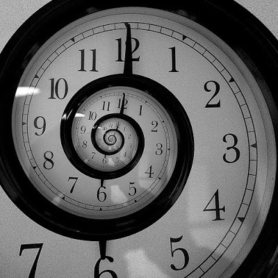
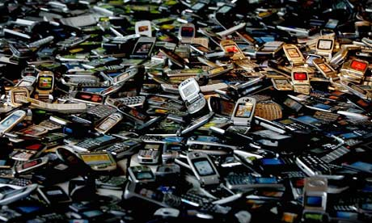

---
layout: single
name: tuketim-psikolojisi
title: "Neden yeni telefon? - Tüketim Psikolojisi"
category: "articles"
---

Bu blogu açtığım günden itibaren pek fazla içerik yazmıyorum aslında. Fakat bazı konular (*bu aralar boş vaktimin daha fazla olmasından sanırım*) aklımı kurcalamıyor değil. Bunların başında tabi ki **"Tüketim Psikolojisi"** geliyor.

{:style="padding-left:10%;width:90%"}

Bir telefon alacakken, ya da bir bilgisayar alacakken alabildiğimizin en iyisini ve en pahalısını almaya çalışıyoruz. Aslında alabileceğimizin en iyisini almak durumu kötü bir olay değil. İyi ve kaliteli bir ürünü uzun süreler kullanabilirsiniz (*örneğin şu anda kullandığım dizüstü bilgisayarımı yaklaşık 6 yıldır kullanıyorum*). Fakat sıkıntı "her yıl yenisini alma" hastalığına sahipseniz ortaya çıkıyor. 

Her 2 yılda bir, yeni bir bilgisayar aldığınızı varsayalım. Günümüzde bir istatistikçi için kullanılabilir, iş görür düzeyde bir bilgisayarın fiyat 2500 TL civarlarından başlıyor. Her 2 yılda bir bilgisayar alma hastalığınız varsa 2500TL / (365*2) = 3,43TL gibi bir günlük ücrete bilgisayarınızı kullanmış oluyorsunuz. Tabi her geçen yıl bilgisayar fiyatlarının artmasından kaynaklı fiyat artışı da kaçınılmaz, o yüzden hadi düz hesap 3,50TL diyelim. Günlük 3,50TL pek fazla bir fiyat gibi gelmeyebilir, hatta biraz fazla takıntılı olduğumu düşünebilirsiniz. Fakat her gün günlük iş gücünüzün 30 dakikasını bilgisayara sahip olmak için çalıştığınızı düşündüğünüzde durum biraz daha ilginç bir hal alıyor. Ve tabi ki diğer masraflarınızın olduğunu da düşündüğünüzde (diğer masraflarınızı da bu şekilde "günlük ne kadar fiyata geleceğini" hesapladığınızda) kazandığınız ücretin aslında geldiği gibi gittiğini, bir birikim ya da hayallerinizi gerçekleştirmek için atmanız gereken ufak atımı atmadığınızı görmeye başlıyorsunuz.

{:style="padding-left:15%;width:85%"}

Para olayından baktığınızda o kadar canınızı yakmıyor, fakat zaman açısından baktığınızda 2 yıl için 365 saatinizi bir bilgisayar almak için harcıyorsunuz. Yani 15 güne tekabul eden bir zaman dilimi (iş günü olarak bakıldığında yaklaşık 40-45 gün). 2 yılda bir değil de 4 yılda bir bilgisayar alsanız, 2 yıl sonrasında kendinize her gün yarım saat daha erken eve gitme izini verebilirsiniz. Psikolojik açıdan aslında çok güzel bir zaman dilimi. Tabi Avrupa'da yaşayıp saatlik ücret alan vatandaşlar olmadığımız için öyle bir durum söz konusu değil, bunun bilincindeyim. Fakat aslında burada yazmaya çalıştığım şey; bir ürünü para ile değil, zaman ile satın alıyorsunuz. O bilgisayarı almak için her gün yarım saat hiç sevmediğiniz bir işi yapmak zorundasınız. Barınmak içinse her ay yaklaşık 120 saat boyunca sevmediğiniz o işi yapmalısınız. Seviyorsanız işinizi ne ala, ama Türkiye sınırları içinde çoğu insanın okuduğu bölümle alakalı bir mesleğinin bile olmadığını düşünürsek sanırım çoğunluk sözlerime hak verecektir.

{:style="width:100%"}

İşin kötüsü bu zamanı zaruri gereklilik olmaksızın buraya harcamaktan öte, birikim olmaksızın satın alım yapmada ortaya çıkıyor. Kredi kartları artık herkesin ceplerinde. Borçların üzerine borçla ürün alma durumu hastalık derecesine geldi. Öyle ki, kredi kartı borçlarını yeni kapatan arkadaşım "*borçlar bitti, bir kredi daha çekip araba alayım diyorum*" şeklinde yorum yapabiliyor. Çünkü borcun bitmesi durumu ve artık kazandığı paranın birikime başlayacak olması durumu ona garip geliyor. Borç ile ürün almaya alışmış bir insan, birikimi bekleyemeyecek sabırsızlığa sahip oluyor. Bazı durumlarda borç ile ürün almanın mantıklı olduğunu belirtmeliyim. Örneğin; sürekli olan bir harcama üzerine kiralamanın satın almadan daha pahalıya gelmesi durumunda gayet mantıklı bir süreç. Buna en güzel örnek tabi ki ev satın almaktır. Kira ücretini ödemektense satın alma ücreti daha cazip kaçabilmekte. Bunun için bankalardan ev kredisi çekilebilmekte. Fakat bir cep telefonu ya da bilgisayar için, yani zamanla fiyatı azalacağı bilinen bir ürün için kredi borçlarına girmek ne kadar mantıklı, tartışılır. O üründen para kazanacaksa dahi örneğin; bir arabayı ele alalım, satın alması mı kiralaması mı kazançlı çıkacak bu hususta hesaplamalar yapılmalı. Bunu kişi kendisi için de işletmeler için de düşünebilir. Bazı durumlarda satın alma tutarı, o ürünün kullanılma süresi göz önüne alındığında kiralamaya nazaran daha cazip gelebilir. Bunun için iyi bir optimizasyon çözümleyicisi (*bknz: bendeniz Aydın Kabataş*) gerekmektedir (*yalnız iyi reklam oldu ha*).

### İyi de n'apalım, eski telefonlarla bilgisayarlarla mı dolaşalım?

Bu tamamiyle **eski** tanımının ne olduğu ile alakalı. Örneğin, neden bilgisayarınızı ya da cep telefonunuzu her yıl yenileme ihtiyacı hissediyor da çamaşır ya da bulaşık makinenizi yenileme ihtiyacı hissetmiyorsunuz? Tüketim alışkanlıklarınız ve psikolojiniz ile alakalı. Dışarıda ya da iş yerinizde çalışırken insanların bilgisayarlarını ve cep telefonlarını görmektesiniz, o sebeple ilk arzuladığınız şey tüketim psikolojisi olarak onların sahip olduğu o en son ve en yeni ürüne sahip olmak. Beyaz eşyalarınız ancak bozulduğunda yeni ürün araştırmasına giriyoruz, fakat cep telefonları ve bilgisayarlar her gün dışarıda konuşulurken laf arasında dahi özelliklerini duyduğumuz cihazlar. Bu sebeple eğer bir birikimimiz varsa ve psikolojik olarak da cihazımızdan sıkılmışsak onu direkt değiştirme yoluna gidiyoruz. Aslında o cihazlara da tıpkı beyaz eşyalara yaptığımız muammeleyi yapmalıyız. Bozulmadığı müddetçe çalışmasına devam etmeli, ihtiyaçlarımızı **GERÇEKTEN KARŞILAYAMAYACAK** durumda olmadığı müddetçe o ürünleri kullanmaya devam etmeliyiz (*daha doğrusu böyle yapmamız gerektiğine inanıyorum*).

{:style="padding-left:5%;width:95%"}

### Bende Nokia 3310 var, hala çalışıyor ama herkesin elinde akıllı telefon var. Değiştirme diyorsun yani?

Kısmen. Sen o telefonu ne amaçla kullanıyorsun? Örneğin benim akıllı telefon kullanma zorunluluğum olmasaydı muhtemelen cebimde 3310 ile gezerdim ve çok da havalı olurdum. Düşünsene, akıllı telefon kullanmayan topluluk içerisindeki nadir genç insanlardan birisiyim :) . Fakat yaptığım işler ve ihtiyaçlarım gereği *Whatsapp* uygulaması kurabileceğim, *Google Maps* uygulaması ile aradığım adrese ait yolumu bulabileceğim, internette rahatça dolaşabileceğim bir cihaza ihtiyacım var. Bu ihtiyacımı da akıllı telefonlar sağlıyor. En son orta yaşlı bir tanıdığım "Ben akıllı telefon alacağım da sence ne alsam" demişti. Ben de "Ne amaçlı kullanacaksın ki abi" demiştim ve cevap olarak "Yahu herkesin elinde var, benim de olsun istiyorum yoksa benim olay belli, mesaj bile yazamam, arayıp konuşurum" cevabını almıştım. Şimdi ben bu orta yaşlı abimize ne diyebilirim ki. Dediğim gibi, önce özençliliği ve tüketim psikolojisini aşmamız gerekmekte. (*Ah be abim, o elindeki Nokia 6230i çok iyiydi, yakışıyordu da sana hani*)

### Anladım, ihtiyacımız olanı alacağız. Peki hangisini? En pahalısı en iyisi mi?

Hayııııııır. Artık bırakın şu "en pahalısı en iyisidir" olayını. Bunun için **"Kalite Nedir?"** sorusunu cevaplayın. Ondan sonra kaliteli olanı alın.

{:style="padding-left:20%;width:80%"}

### Kalite nedir?

Üretim bandından bozuk ürün sayısı minimum sayıda ve standart sapması en az hata ile çıkan, gerekli ihtiyaçları karşılayabilecek özelliklere sahip, vadettiği **"Garanti"**, **"Yedek Parça Temini"** ve **"Onarım Desteği"** hizmetlerine sahip üründür. Şimdi diyeceksiniz "Nereden bilelim biz üretim bandından çıkan ürünün standart sapması neymiş, arıza ortalaması neymiş". Ürünlerin desteğini markalar verir ve hak vererek söylüyorum ki markalar da bu hususta pek şeffaf değil. Kronik bir hata olduğunda mümkün mertebe çok ses çıkartmadan garanti kapsamında düzeltmeye çalışırlar. Satılan ürünlerin kaç tanesinin garanti servisine geldiğini halka açıklamazlar. Aslında açıklasalar eğitim ve anlayış seviyesi yüksek olan bir ülkede çok objektif ve anlayışlı karşılanacaklar, hatta o markaya daha çok güvenecekler (*burada anlatılan ülke Türkiye değildir*). Peki n'apmak lazım? Tabi ki dedikoduları dinleyeceğiz. Dedikodusu çok çıkan varsa, ya da tanıdığınız bir telefon teknik servisi varsa ondan bir yardım alacağız. Dedikoduların %25'i asılsız olsa da %75'i gerçekten yaşanılan durumlardan kaynaklı söylemler olduğundan ona göre önlem alınabilir. Bir ürünün üretim bandından sorunsuz çıkması kadar sonrasında yaşanılacak problemler için garanti, yedek parça temini, onarım desteği durumlarına da bakılmalıdır. Garanti servisi kötü olan bir cihaz başınıza gerçekten dert olabilir (*bkz: ASUS*). Güzelim ülkemde herkes sallamasyon işler yaptığından ötürü (*ülkeye gelen büyük markaların teknik servisleri dahi*) malesef **kaliteli** ürün satan marka sayısı gerçekten çok ama çok az. Benim gözümde gerçekten kaliteli 3 tane marka var (~~buraya 3 marka için reklam gelebilir, mail yoluyla irtibata geçin canolar!~~). Malesef diğer markaların kimisi bant üretiminde kimisi üretim sonrası destekte kalitesiz işler yapıyorlar.

### Taşlar yerine oturdu, eyvallah. Ama sorun şu, hala elimdeki telefonu değiştirmek istiyorum.

Haklısın, bu bir psikoloji işte ne yaparsın... Ben de tüm ihtiyaçlarımı çok iyi görmesine karşın dizüstü bilgisayarımı değiştirmek istiyorum. Mümkünse bir Macbook Pro falan alayım diyorum. Ama hiçbir gereği yokken gerçekten 6000TL bir bilgisayara bütçe çıkarmalı mıyım? Adı üzerinde "**GEREĞİ YOK**" eğer öyle birşey yaparsam kocaman bir israf olacak. Peki elimdeki bilgisayardan ben neden memnun değilim? İşte bunun gerçekten de bir analizini çıkartmalı ve onları düzeltmek için yapılabilecek aksiyonlar sıralanmalı. Aynı şey senin için de geçerli, o değiştirmeyi istediğin ürünün sorunu sence ne?

{:style="width:100%"}

### Eskiden bozuksa tamir edilirdi, şimdi yenisi alınıyor.

Çünkü tamir etmeyi aklımıza getirmiyoruz. Bilgisayarlarda olsun, cep telefonlarında olsun birçok sorun aslında yazılımsal ya da ufak tefek donanımsal sorunlar oluyor fakat onları tamir etmektense yeni bir cihaz almamız gerektiğine inanıyoruz. Bazı durumlarda tamir maliyeti gerçekten yeni bir ürün kadar maliyetli olabiliyor. Bu tip durumlara lafım yok, fakat çoğu zaman zaten elimizdeki üründen sıkılmış olduğumuz için direkt yeni cihaz alma yoluna gidiyoruz. Önce eldeki ürünün tamir ve hurda maliyetleri çıkartılmalı, tahmini kullanım süresi hesaplanmalı, daha sonra yeni bir cihaz almak gerekip gerekmediğinin analizi yapılmalıdır. Örneğin benim durumum için;

Dizüstü bilgisayarımdaki sorunlar, cihazın yavaşlaması ve sürücü desteğinin sona ermiş olması. 
* Bilgisayarımın hızlanması için cihazımdaki 500GB 5400RPM harddiski 240GB SSD diske çevirmem gerekli. Tahmini maliyeti 300-350 TL arasında. 
* Yine hızlanması için cihazımdaki 4GB DDR3 Ram Bellekleri 8 GB'a yükseltmem gerekli. Tahmini maliyeti 240 TL.
* Termal macun yenilemesi gerekli. Tahmini maliyeti 1 TL.
* Klavye tuşları zamanla aşınma ve bozulma problemleri yaşadı. Yeni klavye gerekli. Tahmini maliyeti 35-50 TL.
* Sürücü desteği hususunda Linux işletim sistemi destek verebilmekte. Aslında Windows 10 değil de Windows 7 kullanılırsa da yine sürücü desteği halen alınabilmekte. Tahmini maliyeti ücretsiz.

Gördüğünüz gibi, en kötü senaryo için 641 TL masraf çıktı. Bunları aldıktan sonra takmayı bilmiyorsanız dahi bir bilgisayarcıya götürüp taktırdığınızda size 700TL gibi bir maliyet yansıyacaktır. Günümüz şartlarında (*16.12.2017*) bir Macbook Pro almasam dahi işimi görebilecek herhangi marka bir bilgisayar nereden baksanız 2600 TL. Yaklaşık 1900 TL'lik bir masraftan kurtulmuş oluyorum. 6 yaşında bilgisayar olmasına karşın, günümüz teknolojine baktığımızda (*2600 TL altı bilgisayarlara bakıldığında*) tahmini minimum 4 sene daha rahatlıkla kullanılabilecek teknolojiye sahip bir cihaz. Bu sebeple yeni cihaz almaktansa elimdeki cihazı yükseltmek benim için daha iyi bir seçenek.

---

Günümüzde her cihazın en son ve en lüks modelini alan insanlara malesef imrenilerek değil, özenti gözüyle bakılıyor. Böyle bir durumda olmak aynı zamanda psikolojik bozukluğun da işareti. Herşeyden önce insanların tüketim için değil, insan için yaşaması gerektiğini unutmamanız dileği ile...

